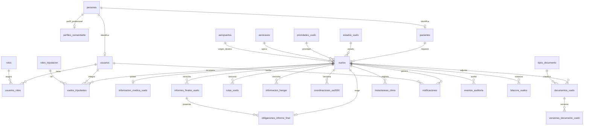

# DER de la base de datos

Generado a partir del catálogo de `vuelos_sanitarios` en SQL Server luego de Flyway V10 (V8 aplicada correctamente). No incluye los objetos técnicos `flyway_schema_history` y `sysdiagrams`.



La relación N:M de tripulación está materializada por `vuelos_tripulantes`; la relación N:M de roles de usuarios, por `usuarios_roles`.
# V11 — cuentas y contactos

```text
personas 1 ── N correos_electronicos
personas 1 ── N telefonos
personas 1 ── 1 usuarios 1 ── N activaciones_cuenta
usuarios N ── N roles
```

